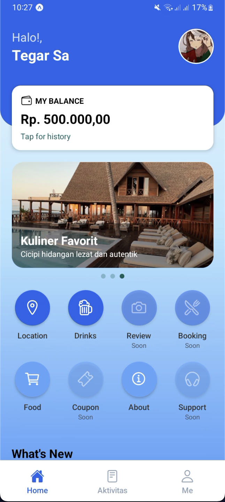
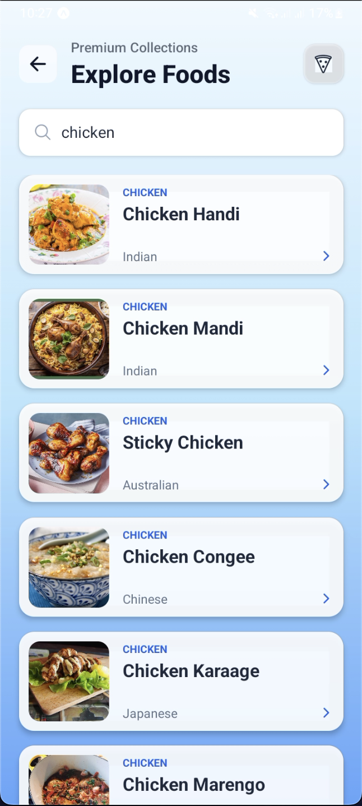
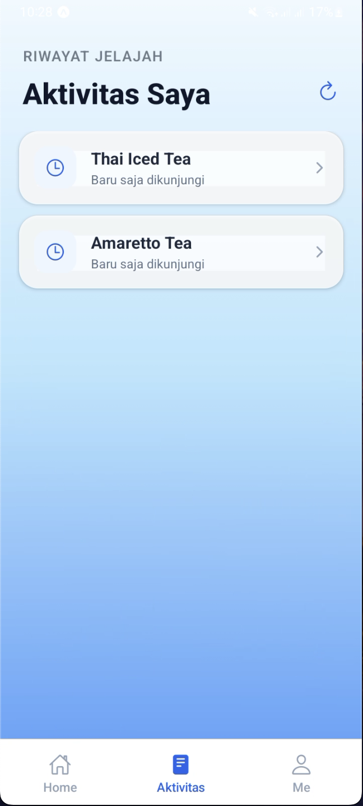
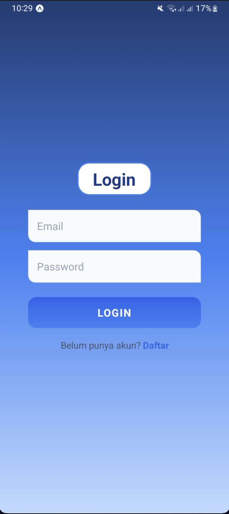

# MyTravelEats

**MyTravelEats** adalah aplikasi mobile yang membantu wisatawan dan traveler menemukan
restoran, kafe, serta makanan dan minuman lokal terbaik di suatu daerah.
Aplikasi ini dirancang untuk memberikan rekomendasi kuliner yang relevan,
mudah diakses, dan ramah bagi wisatawan.

---

## Tujuan Aplikasi
- Membantu wisatawan menemukan kuliner lokal terbaik
- Menyediakan informasi restoran dan kafe di daerah tujuan wisata
- Mendukung pengalaman wisata kuliner yang lebih autentik

---

## Fitur Utama
- Daftar restoran & kafe berdasarkan lokasi
- Rekomendasi makanan dan minuman lokal
- Pencarian dan filter tempat makan
- Detail restoran (foto, deskripsi, kategori)
- Informasi pendukung untuk traveler

---

## Tech Stack
### Frontend
- React Native (Expo)

### Backend
- Node.js
- Express.js

### Database & Services
- Firebase (Authentication / Firestore / Storage)

## Preview Aplikasi

| Home | Food | Drink |
|------|------|-------|
|  |  |  |

| Activity | Login | Profile |
|--------|-------|---------|
|  |  |  |

---

## Struktur Project

```text
mytraveleats/
├── frontend/          # Aplikasi Mobile (React Native)
├── backend/           # REST API (Express.js)
├── README.md
└── .gitignore
```
---

## Cara Menjalankan Project

### Frontend (React Native) dan Backend (Express.js)
```bash
cd frontend
npm install
npm start

cd backend
npm install
npm run dev
```

Catatan
Project ini dikembangkan sebagai aplikasi mobile untuk mendukung wisata kuliner
dan masih dapat dikembangkan lebih lanjut dengan fitur tambahan
